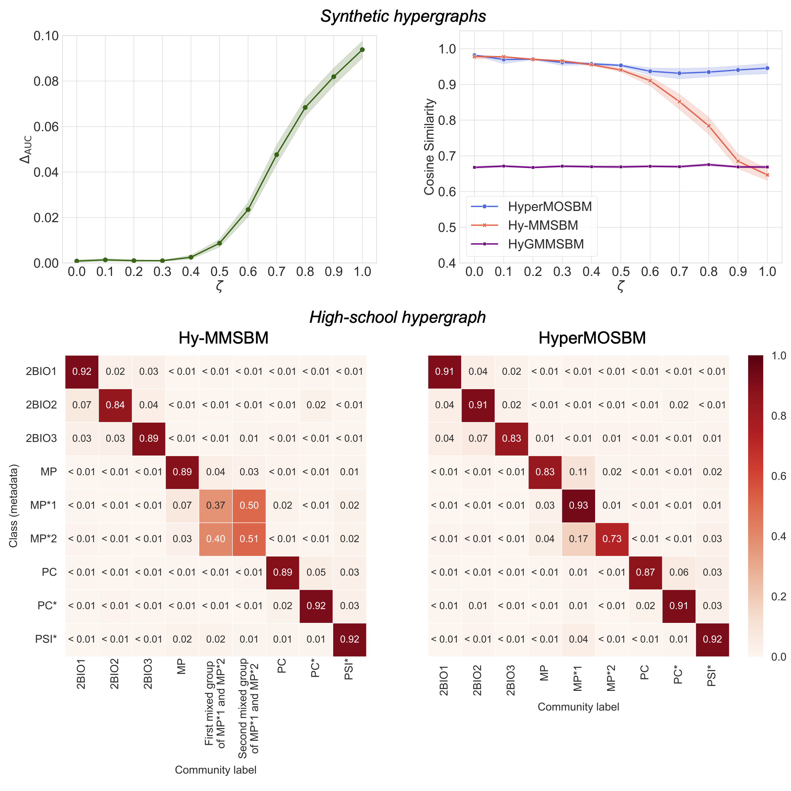

<h1 align="center">
HyperMOSBM <br/>  
<i>Learning Multi-Order Block Structure in Higher-Order Networks</i>
</h1>



This repository provides the code for the paper: **"Learning Multi-Order Block Structure in Higher-Order Networks"**.

We propose a framework, **HyperMOSBM** (Multi-Order Stochastic Block Model), which automatically learns the optimal partition of interaction orders to capture the mesoscale organization of hypergraphs.

If you use this code, please cite:

- [Kazuki Nakajima, Yuya Sasaki, Takeaki Uno, and Masaki Aida. (2025). Learning Multi-Order Block Structure in Higher-Order Networks. arXiv preprint arXiv:2511.21350.](https://arxiv.org/abs/2511.21350)

## Requirements

We confirmed that the code runs in **Python 3.10**.
See `requirements.txt` for the libraries used in our code.

## Setup

1. **Clone this repository:**

   ```bash
   git clone git@github.com:kazuibasou/hypermosbm.git
   cd hypermosbm
   ```

2. **Create a virtual environment (recommended):**

   ```bash
   python3 -m venv venv
   source venv/bin/activate
   ```

3. **Install dependencies:**

   ```bash
   pip install -r requirements.txt
   ```
   
   *Note: We recommend registering the kernel to Jupyter if you plan to run the notebooks interactively.*

## Inference

We provide Jupyter Notebooks to demonstrate the workflow.

*   **`example_inference.ipynb`**:
    Demonstrates how to generate a synthetic hypergraph, search for the optimal order partition, and fit the HyperMOSBM to the data.

*   **`example_high_school_data.ipynb`**:
    Demonstrates the application to the `contact-high-school` dataset. It includes the process of generating prompts for Large Language Models (LLMs) to interpret the inferred communities using node metadata.

## License

This source code is released under the **MIT License**. See `LICENSE` file for details.

# Contact
- Kazuki Nakajima (https://kazuibasou.github.io)
- nakajima@tmu.ac.jp
